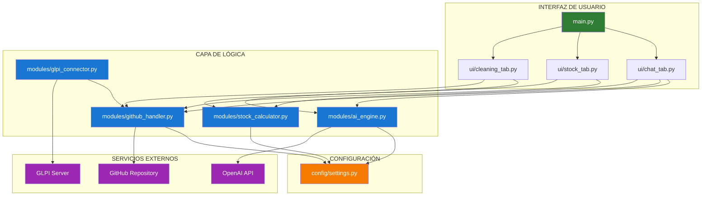
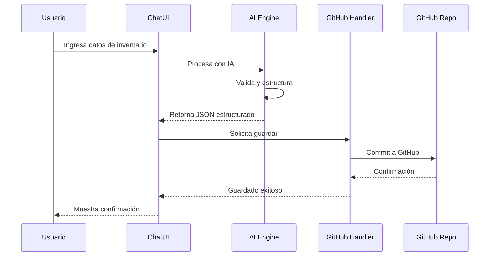

## Flujo de Datos Principal



## Arquitectura de Capas

```
┌─────────────────────────────────────────────┐
│         PRESENTACIÓN (UI)                   │
│  • Chat Tab                                 │
│  • Stock Tab                                │
│  • Cleaning Tab                             │
└─────────────────────────────────────────────┘
                    ↓
┌─────────────────────────────────────────────┐
│         LÓGICA DE NEGOCIO (Modules)         │
│  • AI Engine (Procesamiento IA)             │
│  • GitHub Handler (Sync)                    │
│  • Stock Calculator (Cálculos)              │
│  • GLPI Connector (Integración)             │
└─────────────────────────────────────────────┘
                    ↓
┌─────────────────────────────────────────────┐
│         CONFIGURACIÓN (Config)              │
│  • Settings                                 │
│  • Prompts                                  │
│  • Credenciales                             │
└─────────────────────────────────────────────┘
                    ↓
┌─────────────────────────────────────────────┐
│         SERVICIOS EXTERNOS                  │
│  • OpenAI API                               │
│  • GitHub Repository                        │
│  • GLPI Server                              │
└─────────────────────────────────────────────┘
```
